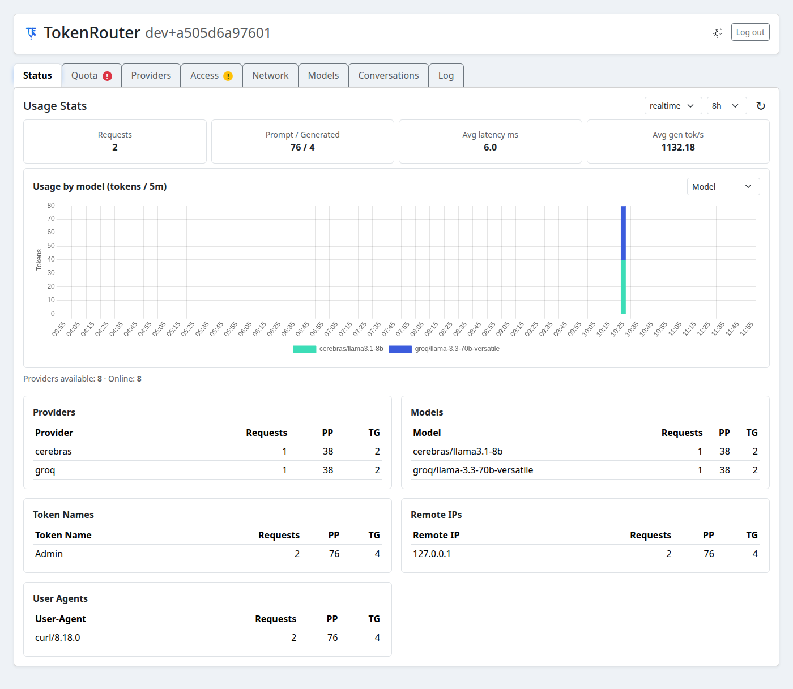

# TokenRouter

<p align="center">
  <strong>One OpenAI-compatible endpoint for all your AI providers.</strong><br/>
  Route, secure, and observe every request from one control plane.
</p>

<p align="center">
  <a href="https://github.com/lkarlslund/tokenrouter/actions/workflows/rolling-release.yml"></a>
  <a href="https://github.com/lkarlslund/tokenrouter/releases"></a>
  <a href="https://github.com/lkarlslund/tokenrouter/releases"></a>
  <a href="https://goreportcard.com/report/github.com/lkarlslund/tokenrouter"></a>
  <a href="LICENSE"></a>
  <a href="https://github.com/lkarlslund/tokenrouter/stargazers"></a>
</p>

<picture>
  <source media="(prefers-color-scheme: dark)" srcset="docs/images/admin-dashboard-dark.png">
  <source media="(prefers-color-scheme: light)" srcset="docs/images/admin-dashboard.png">
  
</picture>

## Why TokenRouter

TokenRouter helps you stop hardcoding provider-specific endpoints and keys across tools and apps.

- Use one `/v1` endpoint with OpenAI-compatible clients.
- Plug in multiple providers and route by `provider/model`.
- Simplify provider setup with built-in presets and provider connection tests.
- Control access with admin/keymaster/inferrer roles.
- Issue temporary subordinate tokens for tools like Codex and Opencode.
- Set request/token quotas and auto-clean expired or depleted keys.
- Track usage, quotas, conversations, and logs in a built-in admin UI.

## Core Capabilities

- OpenAI-compatible API surface for chat, completions, embeddings, model listing, and responses.
- Multi-provider aggregation and model discovery.
- Provider-aware routing with `provider/model` model IDs.
- Optional auto-enable for public free-model providers.
- Access token hierarchy (`admin`, `keymaster`, `inferrer`).
- Token expiry + quota enforcement (requests and tokens).
- Persistent usage analytics (latency, TPS, per-provider/model/key/IP).
- Provider quota inspection and alerts.
- Conversations and request log viewer.
- TLS modes: Let's Encrypt, self-signed, or PEM.

## Quick Start

### 1) Configure server

```bash
torod config
```

### 2) Start server

```bash
torod serve
```

If config does not exist, `serve` launches first-time setup automatically.

### 3) Open admin UI

```text
http://127.0.0.1:8080/admin
```

On first run, TokenRouter opens admin directly and prompts you to create an admin key from a dismissible dialog.

## Use One Endpoint Everywhere

Point any OpenAI-compatible client to TokenRouter:

```bash
export OPENAI_BASE_URL="http://127.0.0.1:8080/v1"
export OPENAI_API_KEY="<tokenrouter_incoming_token>"
```

Route directly to a provider/model:

```json
{
  "model": "groq/llama-3.3-70b-versatile",
  "messages": [{"role": "user", "content": "Hello"}]
}
```

Routing behavior:

- If model is `provider/model`, that provider is used.
- If model is unprefixed, `default_provider` is used when configured.
- Otherwise, TokenRouter falls back to the first enabled provider.

Model aliases:

- Define stable alias names in `torod.toml` and map them to different `provider/model` targets per profile.
- Switch the global `active_model_profile` to move aliases like `chat` from `local` to `runpod` without changing clients.

```toml
active_model_profile = "local"

[[model_aliases]]
name = "chat"

  [[model_aliases.targets]]
  profile = "local"
  provider = "ollama"
  model = "qwen2.5:14b"

  [[model_aliases.targets]]
  profile = "runpod"
  provider = "runpod-main"
  model = "Qwen/Qwen2.5-14B-Instruct"
```

## Temporary Keys for Real Workflows

Use `toro` to create short-lived subordinate keys and run tools safely:

```bash
toro connect
toro --ttl 8h --name "Codex session" codex
toro --ttl 8h --name "Opencode session" opencode
toro --ttl 8h --name "My script run" wrap -- my-command
```

Why this matters:

- Keep your long-lived parent key out of day-to-day tool sessions.
- Give each tool run its own temporary key identity.
- Attribute usage by token name in the dashboard.

## Admin UI

The admin panel at `/admin` includes:

- `Status`: live usage stats, latency, token throughput, provider/model breakdowns.
- `Quota`: provider quota visibility and alerting.
- `Providers`: add/edit/test providers and refresh models.
- `Access`: manage keys, roles, expiry, and quotas.
- `Network`: listener and TLS controls.
- `Models`: aggregated model catalog across providers.
- `Conversations`: inspect stored conversations.
- `Log`: searchable operational logs.

## Install

### From source

```bash
go install github.com/lkarlslund/tokenrouter/cmd/torod@latest
go install github.com/lkarlslund/tokenrouter/cmd/toro@latest
```

### Prebuilt binaries

Download rolling release artifacts from:

- <https://github.com/lkarlslund/tokenrouter/releases>

Releases include `torod` and `toro` for Linux/macOS/Windows, plus Linux packages (`deb`, `rpm`, `archlinux`).

## Author

- **Lars Karlsen**  
  GitHub: [@lkarlslund](https://github.com/lkarlslund)  
  Issues/feedback: [GitHub Issues](https://github.com/lkarlslund/tokenrouter/issues)
